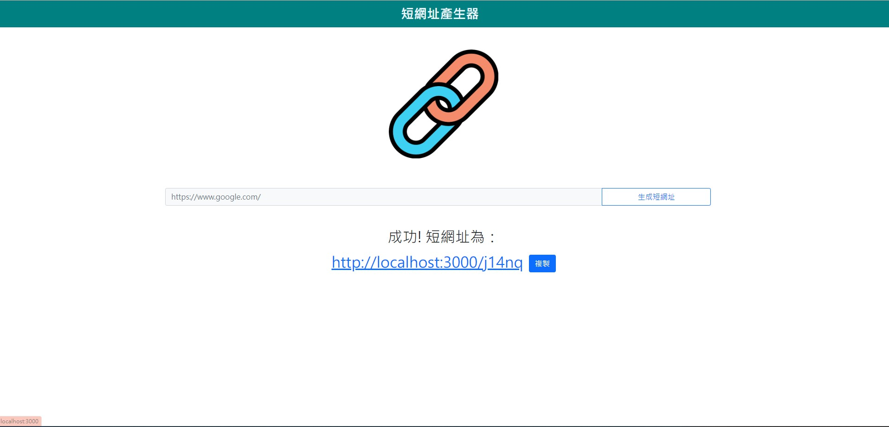

# URL Shortener 短網址產生器

## 介紹

這是一個簡單的短網址產生器，可以將長網址轉換為短網址。

## 功能

- 輸入原始網址，將其轉換為短網址。
- 短網址可以導向原始網址。
- 支援複製短網址到剪貼板。

## 開始使用

1. 請先確認有安裝 node.js 與 npm
2. 將專案 clone 到本地
3. 在本地開啟之後，透過終端機進入資料夾，輸入：

   ```bash
   npm install
   ```

4. 安裝完畢後，繼續輸入：

   ```bash
   npm run dev
   ```

5. 若看見此行訊息則代表順利運行，打開瀏覽器進入到網址[http://localhost:3000/](http://localhost:3000/)

   ```bash
   App is running on http://localhost:3000
   mongodb connected!
   ```

6. 若欲暫停使用

   ```bash
   ctrl + c
   ```

## 開發工具

- Node.js 18.16.0,
- Express 4.18.2
- Express-Handlebars 4.0.2
## 資料庫
- MongoDB
- mongoose 5.9.7

### 開發人員
[Harrison](https://github.com/Harrison0502)